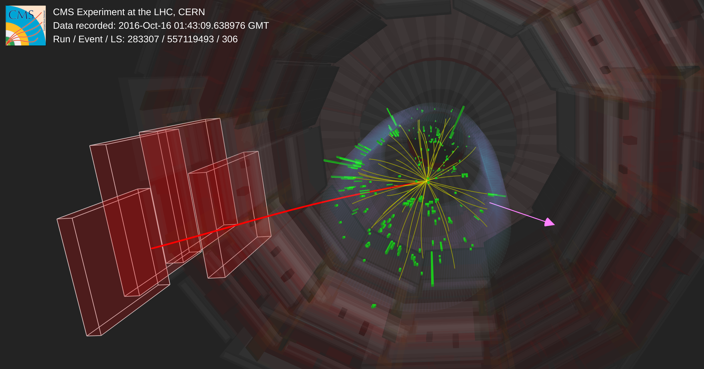

# Project: Inferring new physics at the Large Hadron Collider with classifiers

The accompanying notebook for this project can be found here [](https://colab.research.google.com/github/jonathon-langford/aims-inference-2026/blob/main/2_inference_with_classifiers/project/project.ipynb)

## Introduction
In this project, you will apply the techniques of neural simulation-based inference (SBI) to a problem in particle physics. You will use neural network classifiers to infer the properties of a new particle $A$.

At the Large Hadron Collider (LHC), we have managed to collect a data sample of collisions that contain the decay of a new particle $A$ into two known particles: a muon $\mu$ and a neutrino $\nu$.

$$
A \rightarrow \mu + \nu
$$

This process is very rare, and we have only observed a few collisions ("events") that contain this decay. The data can be found in the file `data_observed/data_project.csv`, which contains 10 events. 

A pictorial representation of one of these collision events is shown below. The particle $A$ is produced in the collision at the primary interaction point. This immediately decays into a muon and a neutrino, which then travel through the detector. The muon (red line) leaves a track in the muon chambers of the detector (red blocks). The neutrino on the other hand interacts very weakly and escapes undetected. We measure its presence from the conservation of energy i.e. we see missing transverse energy (MET) in the direction of the neutrino (purple arrow).



So what information do we have in the data? 

As described above the particle $A$ decays instantaneously, and we have to infer its properties from measurements of its decay products.
We have the following 5D measurements for each event:

* The transverse momentum of the muon, $p_T^\mu$: the component of the muon's momentum perpendicular to the LHC beam axis.
* The pseudo-rapidity of the muon, $\eta^\mu$: a measure related to the angle of the muon with respect to the LHC beam axis.
* The azimuthal angle of the muon, $\phi^\mu$: the angle of the muon in the plane perpendicular to the LHC beam axis.
* The missing transverse energy, MET: the total transverse energy that is not accounted for by detected particles, primarily due to the escaping neutrino.
* The azimuthal angle of the missing transverse energy, $\phi^{MET}$: the angle of the missing transverse energy in the plane perpendicular to the LHC beam axis.

A diagram of the co-ordinate system used in the LHC is shown below, which may help you to understand these measurements.


### Simulating the data
Fortunately, we have a faithful simulator of the $A \rightarrow \mu + \nu$ process. The simulator can generate synthetic collision events for different properties of particle $A$. You will use the simulated collisions to train a neural network classifier, and then use this to infer the properties of particle $A$ from the observed events. 

The simulator can be ran with the following code:
```python
from simulator import run_simulation
data = run_simulation(num_events, spin, mass)
```
where `num_events` is the number of collision events to simulate, `spin` is the spin of particle $A$ (0 or 1), and `mass` is the mass of particle $A$ in GeV. The function returns a pandas dataframe array of shape `(num_events, 5)`, where each row corresponds to a simulated event and the columns correspond to the measurements listed above (in the same order).

## Tasks
This is an incredibly exciting time in fundamental physics... it is the first new discovery in decades which will revolutionize our understanding of the universe. You are tasked with finding out the properties of this new particle and reporting back to the world. It is important that we get this right so that the next collider at CERN can be designed to study this particle in more detail.

You have two main tasks in this project:

1) To infer the **quantum spin** properties of the new particle $A$ based on the observed events. The spin is a purely quantum mechanical property of an elementary particle. It is an intrinsic form of angular momentum, but unlike everyday spinning objects, it does not correspond to any literal rotation in space. Instead, it influences how particles behave, decay, and interact with forces, making it possible to distinguish different types of particles by their spin values. Particle $A$ is of two possible spin values: 
   * Spin-0 (scalar particle)
   * Spin-1 (vector particle)

    You will perform a hypothesis test on these two spin hypotheses using neural SBI. Make sure to justify your choice of input features which go into training the neural network classifier.

2) To infer the mass of the new particle $A$ based on the observed events. The mass of particle $A$ is unknown, but it is known to lie within the range of 0.4 TeV to 1 TeV. You will use neural SBI to estimate the log-likelihood-ratio test-statistic as a function of $m_A$ (the mass of particle $A$). You will then use this to extract the maximum-likelihood estimate and construct a confidence interval for $m_A$. Again, make sure to justify your choice of input features which go into training the neural network classifier for the $m_A$ estimation. Hint: for this you will need to train a parametric classifier!